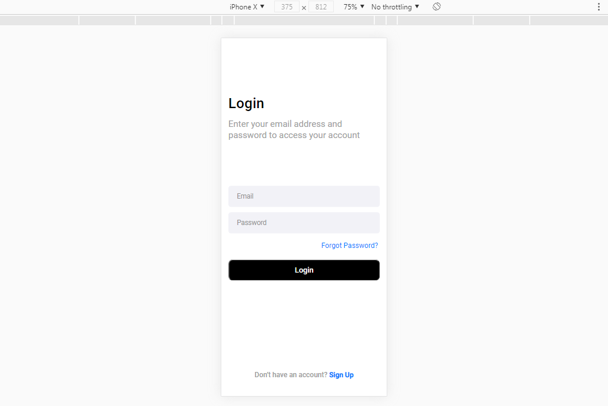

# :iphone:	 Login Interface 
  My first interface. 

###:sunny:	Result

> First interface made by me with css and html

### Tweaks and improvements

the project is still under development and future updates will focus on the following tasks:

- [x] 

- [x] 

- [ ] 

## 🤝 Contributors

We thank the following people who contributed to this project:
<table>
  <tr>
    <td align="center">
      <a href="#">
         
        
          <b>Victor Freguli</b>
        
      </a>
    </td>
    <td align="center">
      <a href="https://github.com/rodolfomori">
         
        
          <b>Rodolfo Mori</b>
        
      </a>
    </td>
   
  </tr>
</table>

[⬆ Voltar ao topo](#login) 
